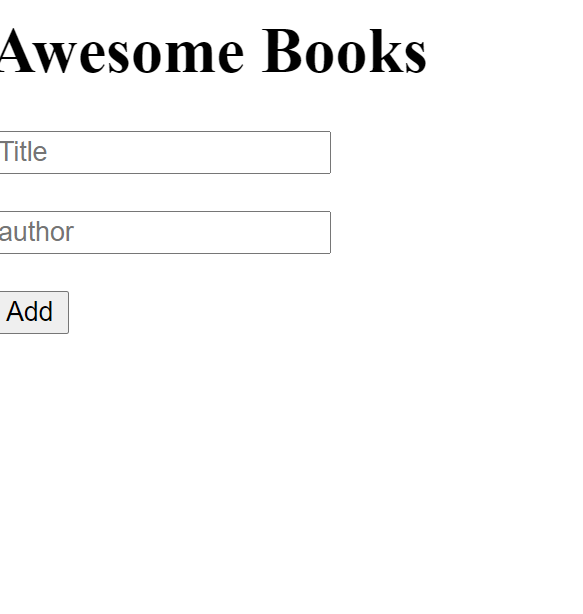

## Awesome Books

This is the first pair programming project for the first week. Its a book library made with javascript only and with basic functionality of adding and removing books and also storing books.

## Built With

Javascript

## Live Demo

[Live Demo Link](https://delhinrharl.github.io/AwesomeBooks/)

## Getting Started

To get a local copy up and running follow these simple example steps.

### Prerequisites

Javaascript,Git basics

### Install

Visual Studio Code Editor
Web Browser
Make a clone of the Repository using git@github.com:DelhinRharl/Portfolio.git

### Run tests

create a workflow folder in the repository folder
and run .github/workflows/linters.yml

## Authors

👤 **Author1**

- GitHub: [@DelhinRharl](https://github.com/DelhinRharl)
- Twitter: [@tdelhinrharl](https://twitter.com/delhinrharl)
- LinkedIn: [LinkedIn](https://linkedin.com/in/AffaxedKiprotich)

👤 **Author2**

- GitHub: [AbdollahRaafat](https://github.com/AbdollahRaafat)
- LinkedIn: [AbdollahRaafat](https://www.linkedin.com/in/abdollah-raafat-886059221/)

👤 **Author1**

- GitHub: [@abdessalem1998](https://github.com/abdessalem1998)
- Twitter: [@HAbdssalem](https://twitter.com/HAbdssalem)

-

## 📝 License

This project is [MIT](./MIT.md) licensed.
